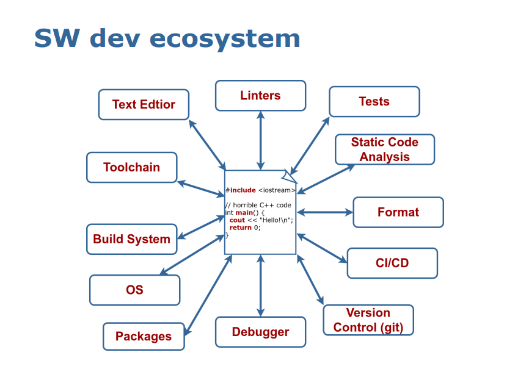
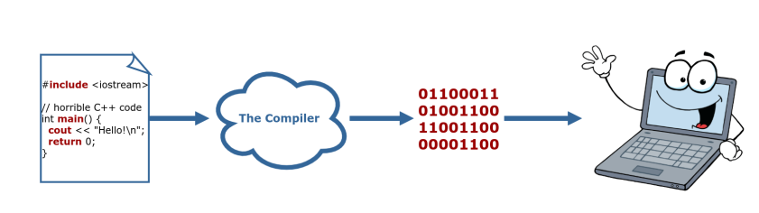

# Lecture 1: Build and Tools

Figure 1 below displays the software development ecosystem. Learning how to understand the ecosystem/tools will help you a lot in programming C++.

<p align="center">
  
  <br>Figure 1 - Software Development Ecosystem<br>
</p>

## 1. The Compilation Process

### 1.1. Definition

What is a compiler?
- A compiler is basically a program.
- It is in charge of transforming your source code into binary code.
- Binary code such as 011010101 is the language that a computer can understand.

<p align="center">
  
  <br>Figure 2 - Compilation Process<br>
</p>

The easiest compile commands possible:
- `clang++ main.cpp`
- This will build a program called `a.out` that's ready to run.
- But it will not always be easy.

### 1.2. Compilation Steps
The compiler performs 4 steps to build your code:
1. Pre-process: Remove/ignore all the comments, open all the header files
2. Compile:  Translates a program written in a specific programming language (C++)into the assembly language code
3. Assembly: Translates our assembly code to the machine code and then stores the result in an object file
4. Link: Combines all external programs (such as libraries and other shared components) with our program to create a final executable

<p align="center">
  
  <br>Figure 3 - Compilation Step by Step<br>
</p>

### 1.3. Compilation Flags
- There is a lof of flags that can be passed while compiling the code,like: `-std=c++17`, `-o`, etc.
- Enable all warnings, treat them as errors: `-Wall`, `-Wextra`, `-Werror`
- Optimization options: `-O0` for no optimizations (default), `-O3` or `-Ofast` for full optimizations
- Keep debugging symbols: `-g`


## 2. Libraries
What is a library?
- Collection of symbols
- Collection of function implementations

- Libraries: multiple object files that are logically connected
- Types of libraries: 
    - Static: Faster, take a lot of space, become part of the end binary, named `lib*.a` (`.a` stands for archive)
    - Dynamic: Slower, can be copied, referenced by a program, named `lib*.so` (`.so` stands for shared object)

### Declaration and Definition
- Function declaration can be separated from the implementation details
- Function declaration sets up an interface:
```
void FuncName(int param);
```
- Function definition holds the implementation of the function that can even be hidden from the user:
```
void FuncName(int param){
    // implementation details.
    cout << "Test this function";
}
```
